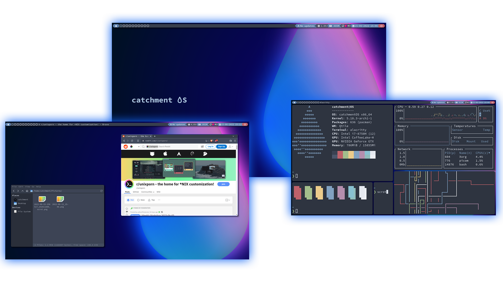

  

<h3 align="center">
   A minimal arch based operating system with a dynamic tiling window manager
</h3>

  
    
  
  
  
  

<h3> Included Software</h3>

<table style=" margin-left: auto;
  margin-right: auto;">
  <tr>
    <th>Software</th>
    <th>Description</th>
  </tr>
  <tr>
    <td>Qtile</td>
    <td>dynamic tiling window manager</td>
  </tr>
  <tr>
    <td>ly</td>
    <td>light-weight login manager</td>
  </tr>
  <tr>
    <td>rofi</td>
    <td>run launcher and shutdown menu</td>
  </tr>
  <tr>
    <td>alacritty</td>
    <td>terminal emulator</td>
  </tr>
  <tr>
    <td>brave</td>
    <td>web browser</td>
  </tr>
  <tr>
    <td>thunar</td>
    <td>GUI file browser</td>
  </tr>
  <tr>
    <td>paru</td>
    <td>AUR package manager</td>
  </tr>
  <tr>
    <td>flameshot</td>
    <td>screenshot tool</td>
  </tr>
</table>

<a href="airootfs/root/catchmentOS-install-script/pkg-files">click here</a> for full list of included packages  

<h3> Keybindings</h3>

<table style=" margin-left: auto;
  margin-right: auto;">
  <tr>
    <th>Key</th>
    <th>Description</th>
  </tr>
  <tr>
    <td>mod + q</td>
    <td>Kill focused window</td>
  </tr>
  <tr>
    <td>mod + return</td>
    <td>Spawn terminal</td>
  </tr>
  <tr>
    <td>mod + d</td>
    <td>Spawn run launcher (rofi)</td>
  </tr>
  <tr>
    <td>mod + b</td>
    <td>Spawn web browser (brave)</td>
  </tr>
  <tr>
    <td>mod + shift + return</td>
    <td>Spawn file browser (thunar)</td>
  </tr>
  <tr>
    <td>mod + shift + h</td>
    <td>Move window to the left</td>
  </tr>
  <tr>
    <td>mod + shift + l</td>
    <td>Move window to the right</td>
  </tr>
  <tr>
    <td>mod + shift + k</td>
    <td>Move window up</td>
  </tr>
  <tr>
    <td>mod + shift + j</td>
    <td>Move window to the down</td>
  </tr>
  <tr>
    <td>mod + ctrl + h</td>
    <td>Grow window to the left</td>
  </tr>
  <tr>
    <td>mod + ctrl + l</td>
    <td>Grow window to the right</td>
  </tr>
  <tr>
    <td>mod + ctrl + k</td>
    <td>Grow window up</td>
  </tr>
  <tr>
    <td>mod + ctrl + j</td>
    <td>Grow window down</td>
  </tr>
  <tr>
    <td>mod + n</td>
    <td>reset window sizes</td>
  </tr>
  <tr>
    <td>mod + f</td>
    <td>toggle fullscreen</td>
  </tr>
  <tr>
    <td>mod + shift + f</td>
    <td>toggle floating</td>
  </tr>
  <tr>
    <td>mod + mouse1</td>
    <td>Move floating window</td>
  </tr>
  <tr>
    <td>mod + mouse2</td>
    <td>Resize floating window</td>
  </tr>
</table>
